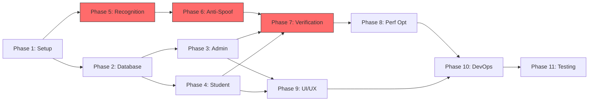

# AutoAttendance — Execution-Ready Task Breakdown

> **Project:** AutoAttendance
> **Generated:** April 15, 2026
> **Total Epics:** 5 | **Total Phases:** 11 | **Total Tasks:** 72 | **Total Subtasks:** 287
> **Estimated Total Effort:** ~290 hours (~7.5 engineer-weeks)

---

## Legend

| Symbol | Meaning |
|---|---|
| ☐ | Not started |
| ☑ | Completed |
| 🔴 | High Priority |
| 🟡 | Medium Priority |
| 🟢 | Low Priority |
| ⛓️ | Has dependency (see Dependencies field) |

---

# 📌 EPIC 1: FOUNDATION & INFRASTRUCTURE

> **Scope:** Project scaffold, dependency management, database schema, and data access layer.
> **Estimated Effort:** ~40 hours
> **Unblocks:** All subsequent Epics.

---

## 🔹 PHASE 1: Project Setup

---

### ☑ TASK 1.1: Initialize Repository & Project Scaffold

- **Description:** Create the root project directory, initialize Git, and create the `.gitignore` with rules for Python artifacts, venv, `.env`, `__pycache__`, and model binaries.
- **Acceptance Criteria:**
  - `AutoAttendance/` directory exists at workspace root
  - Git repo initialized with meaningful `.gitignore`
  - First commit with empty scaffold pushed
- **Estimated Time:** 1 hour
- **Priority:** 🔴 High
- **Dependencies:** None

#### Subtasks:
- ☑ Create root directory `AutoAttendance/`
- ☑ Run `git init`
- ☑ Create `.gitignore` (Python, venv, `.env`, `__pycache__`, `*.onnx`, `*.pth`, `models/`)
- ☑ Make initial commit

---

### ☑ TASK 1.2: Create Full Directory Structure

- **Description:** Create all package directories, `__init__.py` files, and placeholder modules for every component defined in the architecture (admin_app, student_app, core, recognition, anti_spoofing, verification, tasks, tests, docker, scripts).
- **Acceptance Criteria:**
  - All 8 Python packages exist with `__init__.py`
  - All route, template, and static subdirectories created
  - `models/face_detection/` and `models/anti_spoofing/` directories exist
  - `docker/`, `docker/nginx/`, `scripts/`, `tests/` exist
- **Estimated Time:** 1.5 hours
- **Priority:** 🔴 High
- **Dependencies:** TASK 1.1

#### Subtasks:
- ☑ Create `core/` package (`__init__.py`, `config.py`, `database.py`, `models.py`, `extensions.py`, `utils.py`)
- ☑ Create `admin_app/` package with `routes/` subpackage (auth, dashboard, students, courses, attendance, reports), `templates/` subdirs, `static/` subdirs, `forms.py`
- ☑ Create `student_app/` package with `routes/` subpackage (auth, attendance, profile), `templates/` subdirs, `static/` subdirs
- ☑ Create `recognition/` package (`detector.py`, `tracker.py`, `aligner.py`, `embedder.py`, `matcher.py`, `pipeline.py`, `config.py`)
- ☑ Create `anti_spoofing/` package (`model.py`, `blink_detector.py`, `movement_checker.py`, `spoof_detector.py`)
- ☑ Create `verification/` package (`verifier.py`, `session.py`)
- ☑ Create `tasks/` package (`celery_app.py`, `embedding_tasks.py`, `report_tasks.py`, `cleanup_tasks.py`)
- ☑ Create `tests/` package with placeholder test files
- ☑ Create `docker/` directory with `nginx/` subdirectory
- ☑ Create `scripts/` directory (`seed_db.py`, `download_models.py`, `convert_antispoof_to_onnx.py`)
- ☑ Create root files: `run_admin.py`, `run_student.py`, `README.md`

---

### ☑ TASK 1.3: Setup Virtual Environment & Install Dependencies

- **Description:** Create a Python 3.11 virtual environment, create the `requirements.txt` with all verified-compatible dependency versions, and install everything including PyTorch CPU via the official index URL.
- **Acceptance Criteria:**
  - `venv/` directory created with Python 3.11
  - `requirements.txt` contains all dependencies with pinned versions
  - `pip install` completes without errors
  - PyTorch installed from official CPU wheel index
- **Estimated Time:** 2 hours
- **Priority:** 🔴 High
- **Dependencies:** TASK 1.1

#### Subtasks:
- ☑ Create virtual environment: `python -m venv venv`
- ☑ Create `requirements.txt` with all pinned versions (Flask==3.1.3, opencv-contrib-python==4.13.0.92, insightface==0.7.3, onnxruntime==1.24.4, numpy>=1.24.0,<2.0, pymongo==4.16.0, celery==5.6.3, redis==7.4.0, etc.)
- ☑ Install core requirements: `pip install -r requirements.txt`
- ☑ Install PyTorch CPU: `pip install torch==2.11.0 torchvision==0.26.0 --index-url https://download.pytorch.org/whl/cpu`
- ☑ Freeze and lock exact versions: `pip freeze > requirements.lock`

---

### ☑ TASK 1.4: Verify All Library Imports

- **Description:** Write and run a verification script that imports every major library to confirm the dependency matrix has no conflicts.
- **Acceptance Criteria:**
  - All imports succeed without errors: `flask, cv2, insightface, onnxruntime, torch, torchvision, pymongo, celery, redis, scipy, PIL, eventlet, bcrypt`
  - Print version of each library to console
- **Estimated Time:** 0.5 hours
- **Priority:** 🔴 High
- **Dependencies:** TASK 1.3

#### Subtasks:
- ☑ Create `scripts/verify_imports.py` that imports every dependency and prints versions
- ☑ Run script: `python scripts/verify_imports.py`
- ☑ Fix any import or version conflicts that arise

---

### ☑ TASK 1.5: Create Configuration System

- **Description:** Implement the centralized configuration class in `core/config.py` that reads from environment variables (via `python-dotenv`). Create `.env.example` with all required variables documented.
- **Acceptance Criteria:**
  - `core/config.py` contains a `Config` class with properties for all env vars
  - `.env.example` contains every variable with placeholder values and comments
  - Config validates required vars and raises clear errors for missing ones
  - Three config profiles: Development, Testing, Production
- **Estimated Time:** 2 hours
- **Priority:** 🔴 High
- **Dependencies:** TASK 1.2

#### Subtasks:
- ☑ Create `.env.example` with Flask, MongoDB, Redis, Celery, Recognition, Admin, and SocketIO sections
- ☑ Implement `Config` base class with `from_env()` class method
- ☑ Implement `DevelopmentConfig`, `TestingConfig`, `ProductionConfig` subclasses
- ☑ Add validation: raise `ValueError` for missing `FLASK_SECRET_KEY`, `MONGODB_URI`
- ☑ Add type coercion for numeric env vars (thresholds, ports, intervals)
- ☑ Copy `.env.example` → `.env` for local development

---

### ☑ TASK 1.6: Create Shared Extensions Module

- **Description:** Implement `core/extensions.py` with singleton instances of Flask-Login `LoginManager`, Flask-SocketIO `SocketIO`, and Flask-Limiter `Limiter` that can be imported by both apps.
- **Acceptance Criteria:**
  - `login_manager`, `socketio`, `limiter` singleton instances are importable
  - Extensions are not bound to any app yet (bound via `init_app()` in factory)
- **Estimated Time:** 1 hour
- **Priority:** 🔴 High
- **Dependencies:** TASK 1.3, TASK 1.5

#### Subtasks:
- ☑ Create `LoginManager` instance with default login view and message
- ☑ Create `SocketIO` instance with `async_mode='eventlet'`
- ☑ Create `Limiter` instance with default rate limit and key function
- ☑ Export all from `core/__init__.py`

---

### ☑ TASK 1.7: Create Utility Functions Module

- **Description:** Implement `core/utils.py` with reusable helper functions for password hashing, ID generation, date formatting, and input validation.
- **Acceptance Criteria:**
  - `hash_password(plain)` → bcrypt hash string
  - `check_password(plain, hashed)` → bool
  - `generate_id()` → unique hex string
  - `format_datetime(dt)` → ISO string
  - `validate_email(email)` → bool
  - `validate_student_id(sid)` → bool
- **Estimated Time:** 1.5 hours
- **Priority:** 🟡 Medium
- **Dependencies:** TASK 1.3

#### Subtasks:
- ☑ Implement `hash_password()` and `check_password()` using `bcrypt`
- ☑ Implement `generate_id()` using `uuid.uuid4().hex`
- ☑ Implement date helpers: `format_datetime()`, `parse_date()`, `get_today()`
- ☑ Implement validators: `validate_email()`, `validate_student_id()`, `validate_file_upload()`
- ☑ Write unit tests for all utility functions

---

### ☑ TASK 1.8: Create README & Documentation

- **Description:** Write a comprehensive `README.md` with project description, tech stack, setup instructions (dev & Docker), architecture diagram reference, and contributing guidelines.
- **Acceptance Criteria:**
  - README has: Overview, Features, Tech Stack, Quick Start, Architecture, Configuration, Development, Deployment, Testing sections
  - All commands are copy-pasteable
- **Estimated Time:** 1.5 hours
- **Priority:** 🟢 Low
- **Dependencies:** TASK 1.5

#### Subtasks:
- ☑ Write project overview and feature list
- ☑ Document local development setup (venv, .env, run commands)
- ☑ Document Docker deployment instructions
- ☑ Add architecture overview section referencing the implementation plan

---

## 🔹 PHASE 2: Database Design & Data Access

---

### ☑ TASK 2.1: Implement MongoDB Connection Manager

- **Description:** Implement `core/database.py` with a singleton `MongoDBClient` class that manages the connection pool to MongoDB Atlas, handles health checks, and provides automatic retry with exponential backoff.
- **Acceptance Criteria:**
  - Singleton pattern: only one `MongoClient` instance per process
  - `get_db()` returns the configured database
  - `health_check()` pings the server and returns status
  - Connection retry: 3 attempts with 1s, 2s, 4s backoff
  - Graceful error messages for connection failures
- **Estimated Time:** 2 hours
- **Priority:** 🔴 High
- **Dependencies:** TASK 1.5 (config), TASK 1.3 (pymongo installed)

#### Subtasks:
- ☑ Implement `MongoDBClient` class with `__init__` accepting `MONGODB_URI`
- ☑ Implement thread-safe singleton via module-level instance
- ☑ Implement `get_db()` → `pymongo.database.Database`
- ☑ Implement `get_collection(name)` → `pymongo.collection.Collection`
- ☑ Implement `health_check()` → `{"status": "ok", "latency_ms": float}`
- ☑ Implement retry decorator with exponential backoff
- ☑ Implement `close()` method for graceful shutdown

---

### ☑ TASK 2.2: Create Database Index Setup

- **Description:** Implement the `ensure_indexes()` function that creates all required indexes on MongoDB collections at application startup.
- **Acceptance Criteria:**
  - Unique indexes on `students.student_id`, `students.email`, `admins.email`, `courses.course_code`
  - Compound indexes on `attendance_records(course_id, date)` and `attendance_records(student_id, date)`
  - TTL index on `system_logs.timestamp` (90 days)
  - Indexes created are idempotent (safe to run multiple times)
- **Estimated Time:** 1 hour
- **Priority:** 🔴 High
- **Dependencies:** TASK 2.1

#### Subtasks:
- ☑ Create unique indexes for students (student_id, email)
- ☑ Create unique indexes for admins (email) and courses (course_code)
- ☑ Create compound indexes for attendance_records and attendance_sessions
- ☑ Create TTL index on system_logs (expireAfterSeconds=7776000)
- ☑ Call `ensure_indexes()` in app factory startup

---

### ☑ TASK 2.3: Implement AdminDAO

- **Description:** Create the `AdminDAO` class in `core/models.py` that provides CRUD operations for the `admins` collection.
- **Acceptance Criteria:**
  - `create_admin(email, password, name, role)` → inserts admin, returns ID
  - `get_by_email(email)` → returns admin dict or None
  - `get_by_id(admin_id)` → returns admin dict or None
  - `update_admin(admin_id, fields)` → updates only changed fields
  - `update_last_login(admin_id)` → updates last_login timestamp
  - `list_admins(page, per_page)` → paginated results
  - Password is stored as bcrypt hash, never plain text
- **Estimated Time:** 2 hours
- **Priority:** 🔴 High
- **Dependencies:** TASK 2.1, TASK 1.7 (utils for hashing)

#### Subtasks:
- ☑ Implement `create_admin()` with password hashing and timestamp
- ☑ Implement `get_by_email()` and `get_by_id()` queries
- ☑ Implement `update_admin()` with `$set` operator
- ☑ Implement `update_last_login()` timestamp update
- ☑ Implement `list_admins()` with skip/limit pagination
- ☑ Implement `deactivate_admin()` soft-delete

---

### ☑ TASK 2.4: Implement StudentDAO

- **Description:** Create the `StudentDAO` class with CRUD for students plus face embedding management (store, retrieve, update 512-D float32 arrays as BinData).
- **Acceptance Criteria:**
  - Full CRUD for student records
  - `add_embedding(student_id, embedding_array, quality_score, source)` → appends to face_embeddings array
  - `get_embeddings(student_id)` → returns list of embedding dicts
  - `get_roster_embeddings(course_id)` → returns all embeddings for enrolled students
  - `search_students(query, department, year, page, per_page)` → filtered paginated search
  - Embeddings stored as BSON Binary for space efficiency
- **Estimated Time:** 3 hours
- **Priority:** 🔴 High
- **Dependencies:** TASK 2.1, TASK 1.7

#### Subtasks:
- ☑ Implement `create_student()` with password hashing, timestamps
- ☑ Implement `get_by_student_id()` and `get_by_email()`
- ☑ Implement `update_student()` with selective field updates
- ☑ Implement `soft_delete_student()` (set is_active=False)
- ☑ Implement `add_embedding()` — convert numpy array to BinData, append to array
- ☑ Implement `get_embeddings()` — deserialize BinData back to numpy arrays
- ☑ Implement `get_roster_embeddings(course_id)` — aggregate pipeline: course → enrolled students → embeddings
- ☑ Implement `search_students()` with text/regex search, department/year filters, pagination
- ☑ Implement `bulk_create_students(students_list)` for CSV import

---

### ☑ TASK 2.5: Implement CourseDAO

- **Description:** Create the `CourseDAO` class with CRUD for courses, enrollment management, and schedule queries.
- **Acceptance Criteria:**
  - Full CRUD for course records
  - `enroll_student(course_id, student_id)` → adds to both course.enrolled_students and student.enrolled_courses
  - `unenroll_student(course_id, student_id)` → removes from both
  - `get_active_courses_for_student(student_id)` → returns courses the student is enrolled in
  - `get_current_session(course_id)` → returns open session or None
- **Estimated Time:** 2 hours
- **Priority:** 🔴 High
- **Dependencies:** TASK 2.1

#### Subtasks:
- ☑ Implement `create_course()` with schedule validation
- ☑ Implement `get_by_code()` and `get_by_id()`
- ☑ Implement `update_course()` with schedule editing
- ☑ Implement `enroll_student()` — atomic update to both collections
- ☑ Implement `unenroll_student()` — atomic remove from both
- ☑ Implement `get_enrolled_students(course_id)` with pagination
- ☑ Implement `list_courses()` with department filter and pagination

---

### ☑ TASK 2.6: Implement AttendanceDAO & SessionDAO

- **Description:** Create `AttendanceDAO` for attendance records (create, query, aggregate) and `SessionDAO` for attendance session lifecycle (open, close, query).
- **Acceptance Criteria:**
  - `record_attendance(student_id, course_id, confidence, liveness_score, ...)` → inserts record, prevents duplicates for same student+course+date
  - `get_attendance_for_course(course_id, date)` → returns all records for that session
  - `get_attendance_for_student(student_id, start_date, end_date)` → date-range query
  - `get_attendance_stats(course_id)` → aggregation: present/late/absent counts
  - `open_session(course_id, admin_id, settings)` → creates session, returns ID
  - `close_session(session_id)` → marks closed, returns summary
- **Estimated Time:** 3 hours
- **Priority:** 🔴 High
- **Dependencies:** TASK 2.1

#### Subtasks:
- ☑ Implement `AttendanceDAO.record_attendance()` with duplicate check (unique on student_id+course_id+date)
- ☑ Implement `AttendanceDAO.get_for_course()` with date filter
- ☑ Implement `AttendanceDAO.get_for_student()` with date range and course filter
- ☑ Implement `AttendanceDAO.get_stats()` — MongoDB aggregation pipeline for counts
- ☑ Implement `AttendanceDAO.override_status()` for manual corrections
- ☑ Implement `SessionDAO.open_session()` — prevent multiple open sessions per course
- ☑ Implement `SessionDAO.close_session()` — set closed_at, status='closed'
- ☑ Implement `SessionDAO.get_open_session(course_id)` — query for status='open'

---

### ☑ TASK 2.7: Implement LogDAO

- **Description:** Create `LogDAO` for system event logging to the `system_logs` collection.
- **Acceptance Criteria:**
  - `log_event(event_type, actor_id, actor_type, details, ip_address)` → inserts log
  - `get_recent_logs(event_type, limit)` → returns latest logs filtered by type
  - TTL index auto-cleans logs older than 90 days
- **Estimated Time:** 1 hour
- **Priority:** 🟢 Low
- **Dependencies:** TASK 2.1

#### Subtasks:
- ☑ Implement `log_event()` with timestamp auto-set
- ☑ Implement `get_recent_logs()` with type filter and limit
- ☑ Implement `get_logs_by_actor()` for audit trail

---

### ☑ TASK 2.8: Create Database Seeder Script

- **Description:** Create `scripts/seed_db.py` that populates the database with realistic sample data for development and testing.
- **Acceptance Criteria:**
  - Creates 3 admin users (super_admin, admin, viewer) with known passwords
  - Creates 50 students across CS, EE, ME departments
  - Creates 10 courses with realistic schedules
  - Creates 30 days of sample attendance records (80% present, 10% late, 10% absent)
  - Script is idempotent (clears collections before seeding)
  - Prints summary after completion
- **Estimated Time:** 2 hours
- **Priority:** 🟡 Medium
- **Dependencies:** TASK 2.3, TASK 2.4, TASK 2.5, TASK 2.6

#### Subtasks:
- ☑ Implement admin seeder with 3 role types
- ☑ Implement student seeder with realistic names, IDs, departments
- ☑ Implement course seeder with weekly schedules
- ☑ Implement enrollment — assign 15-30 students per course
- ☑ Implement attendance history generator (30 days of records)
- ☑ Add CLI entry point: `python scripts/seed_db.py`

---

### ☑ TASK 2.9: Write Database Unit Tests

- **Description:** Write comprehensive unit tests for all DAO classes using `mongomock` as the mock backend.
- **Acceptance Criteria:**
  - Tests for all CRUD operations on all DAOs
  - Tests for edge cases: duplicate insert, missing record, invalid ID
  - Tests for pagination correctness
  - Tests for embedding serialization/deserialization roundtrip
  - All tests pass with `pytest tests/test_database.py`
- **Estimated Time:** 3 hours
- **Priority:** 🟡 Medium
- **Dependencies:** TASK 2.3, TASK 2.4, TASK 2.5, TASK 2.6, TASK 2.7

#### Subtasks:
- ☑ Create `tests/conftest.py` with mongomock fixture and DB setup
- ☑ Write AdminDAO tests: create, get, update, deactivate
- ☑ Write StudentDAO tests: CRUD, embedding add/get, search, bulk create
- ☑ Write CourseDAO tests: CRUD, enroll/unenroll, roster query
- ☑ Write AttendanceDAO tests: record, duplicate prevention, date range query, stats aggregation
- ☑ Write SessionDAO tests: open, close, prevent double-open

---

# 📌 EPIC 2: WEB APPLICATIONS

> **Scope:** Admin portal (Flask) and Student portal (Flask) with authentication, RBAC, and all CRUD/management routes.
> **Estimated Effort:** ~65 hours
> **Unblocks:** UI/UX Polish (EPIC 4), Integration with ML (EPIC 3).

---

## 🔹 PHASE 3: Admin App Core

---

### ☑ TASK 3.1: Implement Admin App Factory

- **Description:** Create the Flask application factory in `admin_app/__init__.py` that registers all blueprints, initializes extensions, configures error handlers, and sets up request logging.
- **Acceptance Criteria:**
  - `create_app(config_name)` returns a configured Flask app
  - All 6 blueprints registered under `/admin/` URL prefix
  - Flask-Login, Flask-SocketIO, Flask-Limiter initialized via `init_app()`
  - Custom error handlers for 400, 403, 404, 500 returning JSON or HTML based on Accept header
  - Request logging middleware records method, path, status, duration
- **Estimated Time:** 2 hours
- **Priority:** 🔴 High
- **Dependencies:** TASK 1.5, TASK 1.6, TASK 2.1

#### Subtasks:
- ☑ Implement `create_app()` factory function
- ☑ Register blueprints: auth, dashboard, students, courses, attendance, reports
- ☑ Call `extensions.init_app(app)` for login_manager, socketio, limiter
- ☑ Implement error handler templates (400.html, 403.html, 404.html, 500.html)
- ☑ Implement `@app.before_request` logging middleware
- ☑ Configure session cookie security settings

---

### ☑ TASK 3.2: Implement Admin Authentication Routes

- **Description:** Build the auth blueprint with login, logout, password change, and Flask-Login integration.
- **Acceptance Criteria:**
  - `GET /admin/login` renders login form
  - `POST /admin/login` authenticates via AdminDAO, sets session, redirects to dashboard
  - Invalid credentials show error flash message
  - `GET /admin/logout` clears session, redirects to login
  - `GET/POST /admin/change-password` validates old password, sets new one
  - `user_loader` callback loads admin by ID from MongoDB
  - Rate limit: 5 login attempts per 15 minutes per IP
- **Estimated Time:** 3 hours
- **Priority:** 🔴 High
- **Dependencies:** TASK 3.1, TASK 2.3 (AdminDAO)

#### Subtasks:
- ☑ Create `LoginForm` in `forms.py` (email, password, remember_me, CSRF)
- ☑ Implement `GET /admin/login` route rendering login template
- ☑ Implement `POST /admin/login` with credential verification
- ☑ Implement Flask-Login `user_loader` callback
- ☑ Implement `Admin` user class with `UserMixin` properties (is_authenticated, etc.)
- ☑ Implement `GET /admin/logout` with `logout_user()`
- ☑ Implement `GET/POST /admin/change-password` with old password validation
- ☑ Apply `@limiter.limit("5 per 15 minutes")` to login POST
- ☑ Create login.html template with form and error display

---

### ☑ TASK 3.3: Implement RBAC Decorator

- **Description:** Create a reusable `@role_required(*roles)` decorator that checks the current admin's role against allowed roles and returns 403 if unauthorized.
- **Acceptance Criteria:**
  - `@role_required('super_admin', 'admin')` blocks 'viewer' role
  - Returns 403 page with clear "Access Denied" message
  - Works with Flask-Login's `@login_required`
  - Can be stacked on route functions
- **Estimated Time:** 1 hour
- **Priority:** 🔴 High
- **Dependencies:** TASK 3.2

#### Subtasks:
- ☑ Implement `role_required()` decorator using `functools.wraps`
- ☑ Check `current_user.role in roles`
- ☑ Return 403 template for unauthorized access
- ☑ Write unit tests for all role combinations

---

### ☑ TASK 3.4: Implement Student Management Routes

- **Description:** Build the students blueprint with list, detail, add, edit, delete, face upload, and bulk import routes.
- **Acceptance Criteria:**
  - `GET /admin/students` shows paginated list with search by name/ID and filter by department/year
  - `GET /admin/students/<id>` shows profile, attendance summary, face enrollment status
  - `GET/POST /admin/students/add` creates new student with validation
  - `POST /admin/students/<id>/edit` updates student fields
  - `POST /admin/students/<id>/delete` soft-deletes (is_active=False)
  - `POST /admin/students/<id>/upload-face` accepts JPEG/PNG, triggers Celery embedding task
  - `POST /admin/students/bulk-upload` accepts CSV, creates students in batch
  - All routes require admin or super_admin role
- **Estimated Time:** 5 hours
- **Priority:** 🔴 High
- **Dependencies:** TASK 3.1, TASK 3.3, TASK 2.4 (StudentDAO)

#### Subtasks:
- ☑ Create `StudentForm` in forms.py (name, student_id, email, department, year)
- ☑ Implement `GET /admin/students` — paginated list with query params
- ☑ Implement `GET /admin/students/<id>` — detail view with attendance stats
- ☑ Implement `GET/POST /admin/students/add` — create with form validation
- ☑ Implement `POST /admin/students/<id>/edit` — update with validation
- ☑ Implement `POST /admin/students/<id>/delete` — soft delete
- ☑ Implement `POST /admin/students/<id>/upload-face` — file validation (type, size), save to disk, dispatch Celery task
- ☑ Implement `POST /admin/students/bulk-upload` — CSV parsing, batch creation, error reporting
- ☑ Create templates: student_list.html, student_detail.html, student_form.html

---

### ☑ TASK 3.5: Implement Course Management Routes

- **Description:** Build the courses blueprint with CRUD, enrollment management, and attendance session controls.
- **Acceptance Criteria:**
  - `GET /admin/courses` lists courses with department filter
  - `GET/POST /admin/courses/add` creates course with schedule
  - `POST /admin/courses/<id>/edit` edits course and schedule
  - `POST /admin/courses/<id>/enroll` enrolls selected students
  - `POST /admin/courses/<id>/session/open` opens attendance session with mode settings
  - `POST /admin/courses/<id>/session/close` closes active session
  - Only one session open per course at a time
- **Estimated Time:** 4 hours
- **Priority:** 🔴 High
- **Dependencies:** TASK 3.1, TASK 3.3, TASK 2.5 (CourseDAO)

#### Subtasks:
- ☑ Create `CourseForm` in forms.py (code, name, department, instructor, schedule fields)
- ☑ Implement `GET /admin/courses` — filterable course list
- ☑ Implement `GET/POST /admin/courses/add` — create with schedule builder
- ☑ Implement `POST /admin/courses/<id>/edit` — update course details
- ☑ Implement `POST /admin/courses/<id>/enroll` — multi-select student enrollment
- ☑ Implement `POST /admin/courses/<id>/session/open` — create AttendanceSession with settings
- ☑ Implement `POST /admin/courses/<id>/session/close` — close and generate summary
- ☑ Create templates: course_list.html, course_detail.html, course_form.html, enrollment.html

---

### ☑ TASK 3.6: Implement Attendance Management Routes

- **Description:** Build the attendance blueprint with overview, live session view, manual marking, and override capabilities.
- **Acceptance Criteria:**
  - `GET /admin/attendance` shows today's attendance overview by course
  - `GET /admin/attendance/session/<id>` shows live session with real-time check-in feed
  - `POST /admin/attendance/manual` allows marking a student present/late/absent manually
  - `POST /admin/attendance/<id>/override` changes an existing record's status
  - All changes are logged via LogDAO
- **Estimated Time:** 3 hours
- **Priority:** 🔴 High
- **Dependencies:** TASK 3.1, TASK 3.3, TASK 2.6 (AttendanceDAO, SessionDAO)

#### Subtasks:
- ☑ Implement `GET /admin/attendance` — today's overview with per-course stats
- ☑ Implement `GET /admin/attendance/session/<id>` — live session view
- ☑ Implement `POST /admin/attendance/manual` — manual mark form with student/course/status
- ☑ Implement `POST /admin/attendance/<id>/override` — change status with reason
- ☑ Log all manual changes via LogDAO
- ☑ Create templates: attendance_overview.html, session_live.html

---

### ☑ TASK 3.7: Implement Dashboard with SocketIO

- **Description:** Build the dashboard blueprint with real-time statistics powered by Flask-SocketIO.
- **Acceptance Criteria:**
  - `GET /admin/dashboard` renders dashboard page
  - SocketIO `connect` event authenticates admin
  - Dashboard shows: total present today, attendance rate per course, recent 20 check-ins, department breakdown
  - New attendance records push updates to connected dashboards in real-time
  - Stats refresh automatically every 30 seconds
- **Estimated Time:** 3 hours
- **Priority:** 🟡 Medium
- **Dependencies:** TASK 3.1, TASK 3.2, TASK 2.6 ⛓️

#### Subtasks:
- ☑ Implement `GET /admin/dashboard` route with initial stats from DB
- ☑ Implement SocketIO `connect` handler with admin auth check
- ☑ Implement `attendance_update` event emitter (called when attendance is recorded)
- ☑ Implement `stats_refresh` periodic event (every 30s, re-query DB)
- ☑ Create dashboard.html template with stat cards, chart placeholder, activity feed
- ☑ Create dashboard.js with SocketIO client, event handlers, DOM updates

---

### ☑ TASK 3.8: Implement Report Routes

- **Description:** Build the reports blueprint with report generation (dispatched to Celery) and download functionality.
- **Acceptance Criteria:**
  - `GET /admin/reports` shows report generation form (type, date range, course/student filter)
  - `POST /admin/reports/generate` dispatches Celery task, returns task ID
  - `GET /admin/reports/download/<id>` serves generated CSV/PDF file
  - Report types: per-student, per-course, department summary
- **Estimated Time:** 2 hours
- **Priority:** 🟡 Medium
- **Dependencies:** TASK 3.1, TASK 3.3, TASK 2.6

#### Subtasks:
- ☑ Create `ReportForm` in forms.py (type, date_from, date_to, course_id, student_id)
- ☑ Implement `GET /admin/reports` — report configuration page
- ☑ Implement `POST /admin/reports/generate` — validate inputs, dispatch Celery task
- ☑ Implement `GET /admin/reports/download/<id>` — serve file from reports directory
- ☑ Create templates: reports.html, report_status.html

---

### ☑ TASK 3.9: Create Admin Entry Point

- **Description:** Create `run_admin.py` that initializes and runs the admin Flask app with SocketIO support.
- **Acceptance Criteria:**
  - Running `python run_admin.py` starts admin app on port 5000
  - SocketIO is the server (not plain Flask dev server)
  - Debug mode controlled by `.env`
  - App is importable for gunicorn: `gunicorn --worker-class eventlet run_admin:app`
- **Estimated Time:** 0.5 hours
- **Priority:** 🔴 High
- **Dependencies:** TASK 3.1

#### Subtasks:
- ☑ Import and call `create_app()`, bind to `socketio`
- ☑ Add `if __name__ == '__main__'` block with `socketio.run()`
- ☑ Verify app starts and login page renders at `/admin/login`

---

## 🔹 PHASE 4: Student Portal

---

### ☑ TASK 4.1: Implement Student App Factory

- **Description:** Create the Flask application factory in `student_app/__init__.py` that registers student blueprints, initializes extensions, and configures CORS for webcam API.
- **Acceptance Criteria:**
  - `create_app(config_name)` returns a configured Flask app
  - Blueprints registered: auth, attendance, profile under `/student/`
  - CORS configured for webcam getUserMedia and WebSocket
- **Estimated Time:** 1.5 hours
- **Priority:** 🔴 High
- **Dependencies:** TASK 1.5, TASK 1.6, TASK 2.1

#### Subtasks:
- ☑ Implement `create_app()` factory for student app
- ☑ Register blueprints: auth, attendance, profile
- ☑ Initialize extensions (login_manager, socketio for WS)
- ☑ Configure error handlers
- ☑ Create `run_student.py` entry point on port 5001

---

### ☑ TASK 4.2: Implement Student Authentication Routes

- **Description:** Build student auth blueprint with login (student ID + password), logout, and self-registration including face enrollment.
- **Acceptance Criteria:**
  - `POST /student/login` authenticates via StudentDAO
  - `GET/POST /student/register` allows new student registration with face capture
  - Rate limiting: 5 login attempts per 15 minutes
  - Student `user_loader` loads from students collection
- **Estimated Time:** 3 hours
- **Priority:** 🔴 High
- **Dependencies:** TASK 4.1, TASK 2.4 (StudentDAO)

#### Subtasks:
- ☑ Create `StudentLoginForm` (student_id, password)
- ☑ Create `RegistrationForm` (name, student_id, email, password, department, year)
- ☑ Implement `GET/POST /student/login` route
- ☑ Implement `GET /student/logout` route
- ☑ Implement `GET/POST /student/register` with face photo capture step
- ☑ Implement student `user_loader` callback
- ☑ Create templates: login.html, register.html

---

### ☑ TASK 4.3: Implement Webcam Attendance Page & Frame Streaming

- **Description:** Build the attendance route that serves the webcam verification page and handles real-time frame streaming via WebSocket.
- **Acceptance Criteria:**
  - `GET /student/attendance/mark` renders full-screen camera page
  - WebSocket endpoint receives base64 JPEG frames at ~5 FPS
  - Server decodes frames, routes to verification pipeline (mock initially)
  - Server sends back real-time status: face_detected, liveness_check, identity_verified, attendance_marked
  - Session timeout after 30 seconds
- **Estimated Time:** 4 hours
- **Priority:** 🔴 High
- **Dependencies:** TASK 4.1, TASK 4.2

#### Subtasks:
- ☑ Implement `GET /student/attendance/mark` route
- ☑ Implement SocketIO event `start_verification` — create verification session
- ☑ Implement SocketIO event `frame` — receive base64 frame, decode, process
- ☑ Implement SocketIO event `cancel_verification` — cleanup session
- ☑ Implement frame decoding: base64 → numpy array via cv2.imdecode
- ☑ Return mock verification results initially (stub for Phase 7 integration)
- ☑ Create attendance/mark.html template with canvas and video elements

---

### ☑ TASK 4.4: Implement Client-Side Webcam Handler

- **Description:** Build `webcam.js` — the client-side JavaScript that manages camera access, frame capture, WebSocket communication, and UI overlay rendering.
- **Acceptance Criteria:**
  - Requests camera permission, handles denial gracefully
  - Captures frames from `<video>` → `<canvas>` at 640×480
  - Converts to base64 JPEG at quality 0.7
  - Sends via WebSocket at configurable FPS (5 default)
  - Renders face bounding box overlay when server sends coordinates
  - Displays step-by-step verification progress with smooth transitions
  - Shows error states with recovery instructions
- **Estimated Time:** 4 hours
- **Priority:** 🔴 High
- **Dependencies:** TASK 4.3

#### Subtasks:
- ☑ Implement `initCamera()` — getUserMedia with fallback
- ☑ Implement `captureFrame()` — video element → canvas → base64 JPEG
- ☑ Implement WebSocket connection with auto-reconnect logic
- ☑ Implement `sendFrame()` — send base64 frame at FPS interval
- ☑ Implement `drawBoundingBox(bbox)` — render rectangle overlay on canvas
- ☑ Implement verification progress UI: spinner → detect → liveness → match → success
- ☑ Implement "Please blink" and "Turn head left" prompts triggered by server
- ☑ Implement error display: no face, spoof detected, no match, timeout
- ☑ Implement camera cleanup on page leave

---

### ☑ TASK 4.5: Implement Student Attendance History & Profile Routes

- **Description:** Build student profile and attendance history views.
- **Acceptance Criteria:**
  - `GET /student/attendance/history` shows paginated attendance records per course
  - `GET /student/attendance/status` returns today's attendance status for all enrolled courses
  - `GET /student/profile` shows student profile and enrolled courses
  - `POST /student/profile/update-face` allows re-registering face embeddings
- **Estimated Time:** 3 hours
- **Priority:** 🟡 Medium
- **Dependencies:** TASK 4.1, TASK 4.2, TASK 2.4, TASK 2.6

#### Subtasks:
- ☑ Implement `GET /student/attendance/history` — courses filter, date picker, pagination
- ☑ Implement `GET /student/attendance/status` — check today's records for enrolled courses
- ☑ Implement `GET /student/profile` — render profile page
- ☑ Implement `POST /student/profile/update-face` — new face capture flow
- ☑ Implement `GET /student/profile/courses` — list enrolled courses with schedules
- ☑ Create templates: history.html, status.html, profile.html, courses.html

---

# 📌 EPIC 3: ML / AI PIPELINE

> **Scope:** Face detection, tracking, alignment, embedding, matching, anti-spoofing, and end-to-end verification.
> **Estimated Effort:** ~85 hours
> **Unblocks:** Performance Optimization, Production Deployment.

---

## 🔹 PHASE 5: Face Recognition Pipeline

---

### ☑ TASK 5.1: Download & Validate ML Models

- **Description:** Create `scripts/download_models.py` that downloads YuNet detection ONNX, ArcFace embedding model (via insightface buffalo_l pack), and MiniFASNet anti-spoofing ONNX models to the `models/` directory.
- **Acceptance Criteria:**
  - `models/face_detection/face_detection_yunet_2023mar.onnx` exists (338 KB)
  - `~/.insightface/models/buffalo_l/` exists with ArcFace weights (~300 MB)
  - `models/anti_spoofing/2.7_80x80_MiniFASNetV2.onnx` exists
  - `models/anti_spoofing/4_0_0_80x80_MiniFASNetV1SE.onnx` exists
  - Script validates file sizes and checksums
- **Estimated Time:** 2 hours
- **Priority:** 🔴 High
- **Dependencies:** TASK 1.3

#### Subtasks:
- ☑ Download YuNet ONNX from OpenCV model zoo
- ☑ Trigger insightface model download: `insightface.app.FaceAnalysis(name='buffalo_l')`
- ☑ Download/convert MiniFASNet models to ONNX format
- ☑ Implement file validation (size check, load test)
- ☑ Add error message with manual download instructions

---

### ☑ TASK 5.2: Implement YuNet Face Detector

- **Description:** Build `recognition/detector.py` with the `YuNetDetector` class that wraps OpenCV's YuNet DNN face detector.
- **Acceptance Criteria:**
  - `YuNetDetector(model_path, confidence=0.7)` loads model successfully
  - `detect(frame)` returns list of `DetectionResult(bbox, landmarks, confidence)`
  - Input frame is resized to processing resolution internally
  - Coordinates are mapped back to original frame dimensions
  - Faces smaller than 60×60 are filtered out
  - Detection runs in < 15ms on CPU for 640×480 input
- **Estimated Time:** 3 hours
- **Priority:** 🔴 High
- **Dependencies:** TASK 5.1, TASK 1.3

#### Subtasks:
- ☑ Implement `YuNetDetector.__init__()` with model loading via `cv2.FaceDetectorYN.create()`
- ☑ Implement configurable parameters (confidence, NMS, top-K, min face size)
- ☑ Implement `detect(frame)` — resize input, run detection, parse output
- ☑ Implement coordinate remapping: detection coords → original frame coords
- ☑ Implement `DetectionResult` dataclass (bbox, landmarks, confidence)
- ☑ Implement minimum face size filter
- ☑ Write unit tests with sample face images

---

### ☑ TASK 5.3: Implement CSRT Face Tracker

- **Description:** Build `recognition/tracker.py` with the `CSRTTracker` class for inter-frame face tracking.
- **Acceptance Criteria:**
  - `CSRTTracker()` manages one or more CSRT tracker instances
  - `init_track(frame, bbox)` starts tracking a detected face
  - `update(frame)` returns `(success, bbox)` tuple
  - Tracker resets after 5 consecutive failures, IoU < 0.3 disagreement, or every 30 frames
  - `is_same_face(det_bbox, track_bbox)` returns IoU comparison
- **Estimated Time:** 2.5 hours
- **Priority:** 🔴 High
- **Dependencies:** TASK 1.3

#### Subtasks:
- ☑ Implement `CSRTTracker.__init__()` with reset interval config
- ☑ Implement `init_track(frame, bbox)` — create and initialize cv2 tracker
- ☑ Implement `update(frame)` — update tracker, count failures
- ☑ Implement `_should_reset()` — check failure count, frame count, IoU divergence
- ☑ Implement `is_same_face(bbox1, bbox2)` — compute IoU
- ☑ Implement multi-face tracking via dict of tracker instances
- ☑ Write unit tests with sequential frame pairs

---

### ☑ TASK 5.4: Implement Face Aligner

- **Description:** Build `recognition/aligner.py` with the `FaceAligner` class that performs 5-point landmark-based similarity transform to produce 112×112 aligned face crops.
- **Acceptance Criteria:**
  - `FaceAligner()` with ArcFace reference landmark template
  - `align(frame, landmarks)` returns 112×112 BGR numpy array
  - Uses similarity transform via `cv2.estimateAffinePartial2D` or equivalent
  - Handles edge cases: landmarks near frame border, extreme head pose
- **Estimated Time:** 2 hours
- **Priority:** 🔴 High
- **Dependencies:** TASK 1.3

#### Subtasks:
- ☑ Define `REFERENCE_LANDMARKS` constant (5 points for 112×112)
- ☑ Implement `align(frame, landmarks)` using similarity transform
- ☑ Compute transform matrix via `cv2.estimateAffinePartial2D`
- ☑ Apply `cv2.warpAffine` with border handling
- ☑ Add validation: reject if transform error is too large
- ☑ Write unit tests: correct output size, alignment quality

---

### ☑ TASK 5.5: Implement ArcFace Embedder

- **Description:** Build `recognition/embedder.py` with the `ArcFaceEmbedder` class that generates 512-D face embeddings using ONNX Runtime.
- **Acceptance Criteria:**
  - Loads ArcFace ONNX model via `onnxruntime.InferenceSession`
  - `get_embedding(aligned_face_112x112)` returns L2-normalized 512-D float32 numpy array
  - `get_embeddings(faces_list)` supports batch inference
  - Embedding L2 norm ≈ 1.0
  - Single face inference < 30ms on CPU
  - `get_quality_score(face_confidence, alignment_error)` returns float 0-1
- **Estimated Time:** 3 hours
- **Priority:** 🔴 High
- **Dependencies:** TASK 5.1 (models), TASK 5.4 (aligner provides input)

#### Subtasks:
- ☑ Implement `ArcFaceEmbedder.__init__()` with ONNX session creation + graph optimization
- ☑ Implement preprocessing: resize 112×112, BGR→RGB, normalize to [-1,1], transpose NCHW
- ☑ Implement `get_embedding(face)` — run ONNX inference, L2 normalize output
- ☑ Implement `get_embeddings(faces_list)` — batch inference with tensor collation
- ☑ Implement `get_quality_score()` heuristic
- ☑ Implement model lazy loading (singleton session)
- ☑ Write unit tests: output shape (512,), L2 norm ≈ 1.0, same face similarity > 0.5

---

### ☑ TASK 5.6: Implement Face Matcher

- **Description:** Build `recognition/matcher.py` with the `FaceMatcher` class for cosine similarity matching against a gallery of enrolled embeddings.
- **Acceptance Criteria:**
  - `cosine_similarity(emb1, emb2)` returns float in [-1, 1]
  - `match_against_gallery(probe, gallery)` returns sorted top-K matches using vectorized numpy
  - Three threshold levels: STRICT=0.55, BALANCED=0.45, LENIENT=0.35
  - Multi-embedding matching: max similarity across all embeddings per student
  - Embedding cache: load roster into memory, invalidate on update
- **Estimated Time:** 2.5 hours
- **Priority:** 🔴 High
- **Dependencies:** TASK 5.5, TASK 2.4 (StudentDAO for gallery)

#### Subtasks:
- ☑ Implement `cosine_similarity(emb1, emb2)` using numpy dot product
- ☑ Implement `match_against_gallery()` — vectorized: `gallery @ probe.T` → sorted results
- ☑ Implement `MatchResult` dataclass (student_id, similarity, rank)
- ☑ Implement threshold constants and `is_match()` method
- ☑ Implement `EmbeddingCache` class with LRU eviction, pre-warm, invalidation
- ☑ Write unit tests: same person > threshold, different person < threshold, gallery search

---

### ☑ TASK 5.7: Implement Recognition Pipeline Orchestrator

- **Description:** Build `recognition/pipeline.py` with the `RecognitionPipeline` class that coordinates detection → tracking → alignment → embedding → matching with mode-based performance tuning and multi-frame smoothing.
- **Acceptance Criteria:**
  - `RecognitionPipeline(config)` initializes all sub-modules
  - `process_frame(frame)` runs the correct stage based on frame counter + mode
  - Detection/tracking interleave: detect every N frames, track in between
  - Multi-frame smoothing: rolling buffer of 5 results, majority vote ≥ 3/5
  - Three modes: FAST (10/320), BALANCED (5/480), ACCURATE (2/640)
  - FPS counter tracks real-time frame rate
  - `load_gallery(course_id)` loads roster embeddings into matcher cache
- **Estimated Time:** 4 hours
- **Priority:** 🔴 High
- **Dependencies:** TASK 5.2, TASK 5.3, TASK 5.4, TASK 5.5, TASK 5.6

#### Subtasks:
- ☑ Implement `RecognitionPipeline.__init__()` — instantiate detector, tracker, aligner, embedder, matcher
- ☑ Implement `process_frame()` — route to detection or tracking based on frame_count % interval
- ☑ Implement detection→align→embed→match pipeline for detection frames
- ☑ Implement tracking→align→(embed if interval)→(match if embedding) for tracking frames
- ☑ Implement `MultiFrameSmoother` — rolling buffer, majority vote, weighted confidence
- ☑ Implement `RecognitionMode` enum and mode switching
- ☑ Implement frame counter and FPS tracker
- ☑ Implement `load_gallery(course_id)` — preload embeddings from DB
- ☑ Write integration test: process sequence of face frames → get identity

---

### ☑ TASK 5.8: Implement Pipeline Configuration

- **Description:** Create `recognition/config.py` with the `RecognitionConfig` dataclass containing all tunable pipeline parameters.
- **Acceptance Criteria:**
  - Dataclass with defaults matching BALANCED mode
  - `from_env()` class method loads overrides from `.env`
  - `PERFORMANCE_PROFILES` dict maps mode name → parameter set
  - `apply_mode(mode)` updates config to match selected profile
- **Estimated Time:** 1 hour
- **Priority:** 🟡 Medium
- **Dependencies:** TASK 1.5

#### Subtasks:
- ☑ Define `RecognitionConfig` dataclass with all fields and defaults
- ☑ Define `RecognitionMode` enum (FAST, BALANCED, ACCURATE)
- ☑ Define `PERFORMANCE_PROFILES` constant dict
- ☑ Implement `from_env()` with env var overrides
- ☑ Implement `apply_mode(mode)` convenience method

---

## 🔹 PHASE 6: Anti-Spoofing System

---

### ☑ TASK 6.1: Implement MiniFASNet Model Inference

- **Description:** Build `anti_spoofing/model.py` with the `MiniFASNetAntiSpoof` class that runs multi-scale anti-spoofing inference using two ONNX models.
- **Acceptance Criteria:**
  - Loads both ONNX models: MiniFASNetV2 (scale 2.7) and MiniFASNetV1SE (scale 4.0)
  - `predict(frame, face_bbox)` returns `(is_real: bool, score: float)`
  - Multi-scale crop: extract face region at 2 scales, resize to 80×80
  - Preprocessing: BGR→RGB, normalize to [-1,1], transpose NCHW
  - Ensemble: average scores from both models
  - Configurable threshold (default 0.5)
  - Inference < 20ms CPU per frame
- **Estimated Time:** 3 hours
- **Priority:** 🔴 High
- **Dependencies:** TASK 5.1 (models downloaded)

#### Subtasks:
- ☑ Implement `MiniFASNetAntiSpoof.__init__()` — load 2 ONNX sessions
- ☑ Implement `_multi_scale_crop(frame, bbox, scale)` — crop face at specified scale, resize 80×80
- ☑ Implement `_preprocess(crop)` — BGR→RGB, normalize, transpose NCHW
- ☑ Implement `_predict_single(session, preprocessed)` — run ONNX inference, parse output
- ☑ Implement `predict(frame, bbox)` — crop at both scales, run both models, ensemble average
- ☑ Implement `AntiSpoofResult` dataclass (is_real, score, model_scores)
- ☑ Write tests with real and spoof images

---

### ☑ TASK 6.2: Implement Blink Detector

- **Description:** Build `anti_spoofing/blink_detector.py` with Eye Aspect Ratio (EAR) based blink detection.
- **Acceptance Criteria:**
  - `BlinkDetector()` maintains rolling EAR history (30 frames)
  - `update(eye_landmarks)` pushes new EAR value
  - `check()` returns `BlinkResult(blink_detected, blink_count, ear_current, is_natural)`
  - Blink = EAR drops below 0.21 for 2-4 consecutive frames
  - Requires ≥ 1 blink in 5-second window for liveness
  - Detects unnatural patterns (too regular interval = suspicious)
- **Estimated Time:** 2.5 hours
- **Priority:** 🔴 High
- **Dependencies:** TASK 5.2 (provides landmarks)

#### Subtasks:
- ☑ Implement `_compute_ear(eye_landmarks)` — EAR formula
- ☑ Implement `update(landmarks)` — extract eye landmarks, compute EAR, append to buffer
- ☑ Implement `_detect_blink()` — check EAR drops below threshold for 2-4 frames
- ☑ Implement `check()` — return blink count, naturalness score
- ☑ Implement `_is_natural_pattern()` — check blink intervals are irregular (human-like)
- ☑ Write tests with synthetic EAR sequences (blink and no-blink)

---

### ☑ TASK 6.3: Implement Head Movement Checker

- **Description:** Build `anti_spoofing/movement_checker.py` to detect natural head micro-movements and handle challenge-response head turn prompts.
- **Acceptance Criteria:**
  - `MovementChecker()` tracks face bbox center over frames
  - `update(face_bbox)` records position history
  - `check()` returns `MovementResult(is_natural, is_static, displacement_std)`
  - Natural movement = std(position) between 2-8px over 30 frames
  - Static face = std < 1px → flag as possible photo/screen
  - Challenge-response: verify bbox center moved > 20px horizontally on "turn head" prompt
- **Estimated Time:** 2 hours
- **Priority:** 🔴 High
- **Dependencies:** None (standalone logic)

#### Subtasks:
- ☑ Implement `update(face_bbox)` — extract center, append to position buffer
- ☑ Implement `check()` — compute std of positions, classify as natural/static
- ☑ Implement `start_challenge(direction)` — record start position
- ☑ Implement `verify_challenge()` — check displacement > 20px in direction
- ☑ Implement `MovementResult` dataclass
- ☑ Write tests: static sequence → static=True, moving → natural=True

---

### ☑ TASK 6.4: Implement Spoof Detection Orchestrator

- **Description:** Build `anti_spoofing/spoof_detector.py` that combines model, blink, and movement signals into a weighted ensemble liveness decision.
- **Acceptance Criteria:**
  - `SpoofDetector(threshold=0.5)` initializes all sub-detectors
  - `check_liveness(frame, bbox, landmarks)` → `LivenessResult(is_real, score, confidence_level, details)`
  - Weighted ensemble: 50% model + 25% blink + 25% movement
  - Confidence levels: HIGH (all pass), MEDIUM (2 pass), LOW (model only), REJECTED
  - Adaptive threshold: relaxed in low-light conditions
- **Estimated Time:** 2 hours
- **Priority:** 🔴 High
- **Dependencies:** TASK 6.1, TASK 6.2, TASK 6.3

#### Subtasks:
- ☑ Implement `SpoofDetector.__init__()` — instantiate model, blink, movement
- ☑ Implement `check_liveness()` — run all checks, compute weighted score
- ☑ Implement `_classify_confidence()` → HIGH / MEDIUM / LOW / REJECTED
- ☑ Implement `LivenessResult` dataclass with all sub-scores
- ☑ Write integration test: real face → HIGH, printed photo → REJECTED

---

## 🔹 PHASE 7: Verification System

---

### ☑ TASK 7.1: Implement Verification Session Manager

- **Description:** Build `verification/session.py` with session state management for multi-frame verification workflows, persisted in Redis.
- **Acceptance Criteria:**
  - `VerificationSession` dataclass with all state fields
  - `create_session(student_id, course_id)` → unique session_id
  - `get_session(session_id)` retrieves from Redis
  - `update_session(session_id, results)` appends frame results
  - Sessions expire from Redis after 5 minutes (TTL)
  - Max 150 frames per session (30s at 5 FPS)
- **Estimated Time:** 2 hours
- **Priority:** 🔴 High
- **Dependencies:** TASK 1.3 (redis), TASK 1.5 (config)

#### Subtasks:
- ☑ Define `VerificationSession` dataclass
- ☑ Implement `SessionManager.__init__()` with Redis client
- ☑ Implement `create_session()` — generate ID, serialize to Redis with TTL
- ☑ Implement `get_session()` — deserialize from Redis
- ☑ Implement `update_session()` — append recognition + liveness results
- ☑ Implement `delete_session()` cleanup
- ☑ Write tests with mock Redis

---

### ☑ TASK 7.2: Implement Verification Engine

- **Description:** Build `verification/verifier.py` with the main `Verifier` class that orchestrates per-frame processing through recognition + anti-spoofing, aggregates multi-frame results, and records attendance on success.
- **Acceptance Criteria:**
  - `start_session(student_id, course_id)` → starts session, loads gallery
  - `process_frame(session_id, frame)` → runs pipeline + anti-spoofing, returns intermediate status
  - `finalize(session_id)` → majority vote on recognition, check liveness pass rate ≥ 60%, verify identity matches student_id, record attendance if all pass
  - `VerificationResult` includes: status, confidence, liveness_score, message, attendance_recorded
  - Emits SocketIO event on success (for admin dashboard)
- **Estimated Time:** 4 hours
- **Priority:** 🔴 High
- **Dependencies:** TASK 7.1, TASK 5.7 (pipeline), TASK 6.4 (spoof detector), TASK 2.6 (attendance DAO)

#### Subtasks:
- ☑ Implement `Verifier.__init__()` with pipeline, spoof_detector, session_manager
- ☑ Implement `start_session()` — create session, load target + roster embeddings
- ☑ Implement `process_frame()` — decode, run pipeline, run anti-spoofing, update session
- ☑ Implement intermediate result generation for real-time UI feedback
- ☑ Implement `finalize()` — aggregate results, make decision, record attendance
- ☑ Implement `_aggregate_recognition()` — majority vote with weighted confidence
- ☑ Implement `_aggregate_liveness()` — pass rate ≥ 60% check
- ☑ Implement `_record_attendance()` — insert via AttendanceDAO
- ☑ Implement SocketIO event emission on verification success
- ☑ Define `VerificationResult` dataclass with all status fields
- ☑ Write integration tests: success path, spoof rejection, wrong person, timeout

---

### ☑ TASK 7.3: Integrate Verification with Student WebSocket Endpoint

- **Description:** Connect the Verifier engine to the student app's WebSocket frame handler, replacing the mock responses from TASK 4.3.
- **Acceptance Criteria:**
  - WebSocket `start_verification` event creates a real Verifier session
  - Each `frame` event runs `verifier.process_frame()` and sends result
  - On threshold reached, auto-finalize and send success/failure
  - On timeout, auto-finalize with timeout result
  - Result types map to UI states in webcam.js
- **Estimated Time:** 2 hours
- **Priority:** 🔴 High
- **Dependencies:** TASK 7.2, TASK 4.3, TASK 4.4

#### Subtasks:
- ☑ Replace mock handler in student attendance SocketIO with real Verifier calls
- ☑ Map `process_frame()` intermediate results to WebSocket response format
- ☑ Implement auto-finalize on recognition consensus reached
- ☑ Implement 30-second timeout with auto-finalize
- ☑ End-to-end test: camera → frames → server → recognition → attendance recorded

---

# 📌 EPIC 4: OPTIMIZATION & POLISH

> **Scope:** Performance tuning, UI/UX design, background jobs, and Celery integration.
> **Estimated Effort:** ~55 hours
> **Unblocks:** Deployment, Final Testing.

---

## 🔹 PHASE 8: Performance Optimization

---

### ☑ TASK 8.1: Implement Frame Scaling & Coordinate Remapping

- **Description:** Add configurable frame scaling to the pipeline that downscales input before detection and remaps coordinates to original resolution.
- **Acceptance Criteria:**
  - FAST: 320×240, BALANCED: 480×360, ACCURATE: 640×480
  - Scale factor applied via `cv2.resize` with `INTER_LINEAR`
  - Detected bbox and landmarks multiplied by inverse scale factor
  - Alignment always uses original-resolution crop for embedding quality
- **Estimated Time:** 1.5 hours
- **Priority:** 🟡 Medium
- **Dependencies:** TASK 5.7

#### Subtasks:
- ☑ Add `frame_scale` to pipeline config per mode
- ☑ Implement `_scale_frame(frame)` and `_remap_coords(detections)`
- ☑ Ensure alignment crops from original frame, not scaled frame
- ☑ Benchmark: measure FPS before/after scaling at each mode

---

### ☑ TASK 8.2: Implement Adaptive Detection Interval

- **Description:** Make detection interval dynamic based on tracker confidence — reduce detection frequency when tracking is stable, increase when uncertain.
- **Acceptance Criteria:**
  - Tracker confidence high → detect every 10 frames
  - Tracker uncertain → detect every 3 frames
  - Tracker lost → detect every frame until found
  - Skip detection if face bbox moved < 3px
- **Estimated Time:** 1.5 hours
- **Priority:** 🟡 Medium
- **Dependencies:** TASK 5.7, TASK 5.3

#### Subtasks:
- ☑ Implement `_get_dynamic_interval(tracker_state)` in pipeline
- ☑ Add tracker confidence signal to CSRT tracker
- ☑ Implement bbox movement check (skip threshold: 3px)
- ☑ Benchmark FPS improvement

---

### ☑ TASK 8.3: Implement ONNX Runtime Optimization

- **Description:** Configure ONNX Runtime sessions with graph optimization, thread tuning, and memory pattern optimization for all models.
- **Acceptance Criteria:**
  - Graph optimization level = ORT_ENABLE_ALL
  - Intra-op threads = min(4, cpu_count)
  - Memory pattern optimization enabled
  - GPU execution provider config documented (for GPU deployments)
- **Estimated Time:** 1.5 hours
- **Priority:** 🟡 Medium
- **Dependencies:** TASK 5.5, TASK 6.1

#### Subtasks:
- ☑ Create shared `create_onnx_session(model_path, gpu=False)` utility
- ☑ Configure session options: graph optimization, threads, memory pattern
- ☑ Add GPU provider configuration option (CUDA EP)
- ☑ Benchmark latency: before vs after optimization

---

### ☑ TASK 8.4: Implement Model Lazy Loading

- **Description:** Ensure all ML models are loaded on first use (not at application startup), then cached as singletons for subsequent calls.
- **Acceptance Criteria:**
  - App startup time < 2 seconds (no model loading)
  - First verification request loads models (~3-5 seconds one-time cost)
  - Subsequent requests use cached model instances (< 1ms overhead)
  - Models remain in memory until process shutdown
- **Estimated Time:** 1.5 hours
- **Priority:** 🟡 Medium
- **Dependencies:** TASK 5.2, TASK 5.5, TASK 6.1

#### Subtasks:
- ☑ Implement lazy-loading pattern in `YuNetDetector` (load on first `detect()` call)
- ☑ Implement lazy-loading in `ArcFaceEmbedder`
- ☑ Implement lazy-loading in `MiniFASNetAntiSpoof`
- ☑ Thread-safe singleton using `threading.Lock`
- ☑ Measure startup time before/after

---

### ☑ TASK 8.5: Implement Profiling & Benchmarks

- **Description:** Add per-stage timing instrumentation and create a benchmark script that measures pipeline latency across all modes.
- **Acceptance Criteria:**
  - Each pipeline stage logs execution time (detect, track, align, embed, match, antispoof)
  - `PipelineProfiler` class tracks p50, p95, p99 latency per stage
  - `scripts/benchmark_pipeline.py` runs N frames through pipeline, outputs summary table
  - FPS counter with 30-frame rolling average
  - Memory usage tracking via `tracemalloc`
- **Estimated Time:** 2.5 hours
- **Priority:** 🟡 Medium
- **Dependencies:** TASK 5.7, TASK 6.4

#### Subtasks:
- ☑ Implement `PipelineProfiler` class with stage timing
- ☑ Add `@timed` decorator or context manager for each stage
- ☑ Implement FPS counter with rolling average
- ☑ Create `scripts/benchmark_pipeline.py` — process N sample frames, print timing table
- ☑ Add memory tracking using `tracemalloc`
- ☑ Document benchmark results for CPU and GPU

---

## 🔹 PHASE 9: UI/UX Implementation

---

### ☑ TASK 9.1: Create Design System & Base CSS

- **Description:** Define the CSS design system with custom properties (design tokens) for colors, typography, spacing, shadows, and transitions. Create base CSS with reset, global styles, and component classes.
- **Acceptance Criteria:**
  - CSS custom properties defined in `:root` for light mode and `[data-theme="dark"]` for dark mode
  - Color palette: primary (indigo-600), secondary (emerald-500), danger, warning, info, neutrals
  - Typography: Inter font via Google Fonts, 6 weight levels
  - Component classes: `.btn`, `.btn-primary`, `.input`, `.card`, `.badge`, `.alert`, `.modal`, `.table`
  - Responsive breakpoints: mobile < 640px, tablet 640-1024px, desktop > 1024px
- **Estimated Time:** 4 hours
- **Priority:** 🟡 Medium
- **Dependencies:** None (can start anytime)

#### Subtasks:
- ☑ Create `admin_app/static/css/base.css` with CSS reset and `:root` variables
- ☑ Define color palette tokens (8 colors × 10 shades) in light and dark mode
- ☑ Define typography scale (--font-xs through --font-3xl, weights, line-heights)
- ☑ Define spacing scale (--space-1 through --space-16)
- ☑ Create button component styles (primary, secondary, danger, ghost, sizes)
- ☑ Create form input styles (text, select, checkbox, file upload)
- ☑ Create card, table, modal, badge, alert component styles
- ☑ Copy styles to `student_app/static/css/base.css`

---

### ☑ TASK 9.2: Build Admin Dashboard UI

- **Description:** Design and implement the admin dashboard HTML/CSS/JS with sidebar navigation, stat cards, attendance chart, and activity feed.
- **Acceptance Criteria:**
  - Sidebar with logo, nav links, user info, logout button
  - 4 stat cards: Total Present, Attendance Rate, Active Sessions, Total Students (animated counters)
  - Attendance chart: bar or line chart (daily/weekly) using Chart.js
  - Activity feed: scrollable list of last 20 check-ins, updated via SocketIO
  - Dark/light mode toggle
  - Responsive: sidebar collapses on mobile
- **Estimated Time:** 5 hours
- **Priority:** 🟡 Medium
- **Dependencies:** TASK 9.1, TASK 3.7

#### Subtasks:
- ☑ Create `base.html` template with sidebar, header, main content area
- ☑ Create sidebar component with nav links and responsive collapse
- ☑ Create stat cards with animated counters (CSS counter-animation or JS)
- ☑ Integrate Chart.js for attendance trend chart
- ☑ Create activity feed component with live SocketIO updates
- ☑ Create `dashboard.js` — SocketIO connection, stat updates, chart rendering
- ☑ Implement dark/light mode toggle with localStorage persistence

---

### ☑ TASK 9.3: Build Student Verification UI

- **Description:** Design and implement the webcam verification page with full-screen camera, face overlay, step-by-step progress indicator, and success/error states.
- **Acceptance Criteria:**
  - Full-screen camera view with semi-transparent face oval guide
  - Face bounding box overlay: green (detected), red (not detected), amber (processing)
  - 5-step progress bar: Camera → Detect → Liveness → Verify → Done
  - Animated prompts: "Blink naturally", "Turn head left"
  - Success: green checkmark with confetti-like animation
  - Error: clear message with retry button
  - Mobile-responsive: portrait mode support
- **Estimated Time:** 5 hours
- **Priority:** 🟡 Medium
- **Dependencies:** TASK 9.1, TASK 4.4

#### Subtasks:
- ☑ Create `mark.html` with full-viewport camera layout
- ☑ Create face oval guide overlay using CSS/SVG
- ☑ Implement bounding box rendering in `webcam.js` (color-coded by state)
- ☑ Create 5-step progress bar component with CSS animations
- ☑ Implement liveness prompt display ("Blink naturally", "Turn head left")
- ☑ Create success animation (checkmark, green pulse)
- ☑ Create error states UI with clear messaging and retry button
- ☑ Test on mobile devices (portrait and landscape)

---

### ☑ TASK 9.4: Build Admin CRUD Pages

- **Description:** Implement polished templates for student list, student detail, course list, course detail, attendance overview, and report pages.
- **Acceptance Criteria:**
  - All pages use the design system consistently
  - Tables are sortable and filterable
  - Forms have proper validation feedback (inline errors)
  - Modals for confirmation dialogs (delete, override)
  - Loading states for async operations
- **Estimated Time:** 5 hours
- **Priority:** 🟡 Medium
- **Dependencies:** TASK 9.1, TASK 3.4, TASK 3.5, TASK 3.6, TASK 3.8

#### Subtasks:
- ☑ Create student_list.html with search, filters, pagination
- ☑ Create student_detail.html with profile card, attendance history table, face preview
- ☑ Create student_form.html (add/edit) with inline validation
- ☑ Create course_list.html with department filter, status badges
- ☑ Create course_detail.html with enrolled students, session controls
- ☑ Create attendance_overview.html with per-course stat rows
- ☑ Create reports.html with form and download links
- ☑ Implement confirmation modals for destructive actions

---

### ☑ TASK 9.5: Implement Responsive & Accessible Design

- **Description:** Ensure all pages are fully responsive across mobile/tablet/desktop and meet WCAG 2.1 AA accessibility standards.
- **Acceptance Criteria:**
  - All pages function at 320px, 640px, 1024px, 1440px viewports
  - Admin sidebar collapses to bottom nav on mobile
  - Tables convert to card layout on mobile
  - All interactive elements are keyboard navigable
  - ARIA labels on dynamic content, modals, and live regions
  - Skip-to-content link present
  - Focus indicators visible
- **Estimated Time:** 3 hours
- **Priority:** 🟢 Low
- **Dependencies:** TASK 9.2, TASK 9.3, TASK 9.4

#### Subtasks:
- ☑ Add media query breakpoints to all templates
- ☑ Implement sidebar responsive collapse (hamburger menu on mobile)
- ☑ Implement table → card view conversion on small screens
- ☑ Add `tabindex`, `role`, `aria-label` to interactive elements
- ☑ Add `aria-live="polite"` to SocketIO-updated regions
- ☑ Add skip-to-content link in base.html
- ☑ Verify focus indicators are visible on all interactive elements

---

## 🔹 PHASE 8B: Background Jobs (Celery)

---

### ☑ TASK 8B.1: Configure Celery Application

- **Description:** Set up the Celery application in `tasks/celery_app.py` with Redis broker, task auto-discovery, and serialization settings.
- **Acceptance Criteria:**
  - Celery app configured with Redis broker and result backend
  - Tasks auto-discovered from `tasks/` package
  - JSON serializer configured
  - Task retry policy: 3 retries with exponential backoff
  - `celery -A tasks.celery_app worker` starts successfully
- **Estimated Time:** 1.5 hours
- **Priority:** 🟡 Medium
- **Dependencies:** TASK 1.3, TASK 1.5

#### Subtasks:
- ☑ Implement `celery_app.py` with `Celery('autoattendance', broker=REDIS_URL)`
- ☑ Configure `task_serializer`, `result_serializer`, `accept_content`
- ☑ Configure `task_acks_late`, `worker_prefetch_multiplier`
- ☑ Configure retry policy: `max_retries=3`, `retry_backoff=True`
- ☑ Verify worker starts and can receive tasks

---

### ☑ TASK 8B.2: Implement Embedding Generation Task

- **Description:** Create `tasks/embedding_tasks.py` with a Celery task that generates face embeddings from uploaded photos and stores them in MongoDB.
- **Acceptance Criteria:**
  - `generate_embedding.delay(student_id, photo_path)` dispatches task
  - Task loads photo, detects face, aligns, generates embedding, stores in StudentDAO
  - Returns success/failure with quality score
  - Handles: no face found, multiple faces, low quality
- **Estimated Time:** 2 hours
- **Priority:** 🟡 Medium
- **Dependencies:** TASK 8B.1, TASK 5.2, TASK 5.5, TASK 2.4

#### Subtasks:
- ☑ Implement `@celery_app.task` for `generate_embedding`
- ☑ Load image from path, run face detection
- ☑ Validate: exactly one face, sufficient size, acceptable pose
- ☑ Align face, generate embedding, compute quality score
- ☑ Store embedding via `StudentDAO.add_embedding()`
- ☑ Return result dict with status and quality score

---

### ☑ TASK 8B.3: Implement Report Generation Task

- **Description:** Create `tasks/report_tasks.py` with Celery tasks for generating attendance reports in CSV format.
- **Acceptance Criteria:**
  - `generate_report.delay(report_type, filters)` dispatches task
  - Supports: per-student, per-course, department summary report types
  - Queries AttendanceDAO with date range and filters
  - Writes CSV to `reports/` directory
  - Returns file path for download
- **Estimated Time:** 2 hours
- **Priority:** 🟢 Low
- **Dependencies:** TASK 8B.1, TASK 2.6

#### Subtasks:
- ☑ Implement `generate_report` Celery task
- ☑ Implement per-student report: attendance % per course, dates present/absent
- ☑ Implement per-course report: all students, attendance rates
- ☑ Implement department summary: aggregate by department
- ☑ Write CSV using Python `csv` module
- ☑ Return file path for download endpoint

---

### ☑ TASK 8B.4: Implement Cleanup Task

- **Description:** Create `tasks/cleanup_tasks.py` with periodic maintenance tasks.
- **Acceptance Criteria:**
  - `cleanup_expired_sessions.delay()` removes stale Redis sessions
  - `archive_old_logs.delay()` handled by TTL index (just verify)
  - Tasks scheduled via Celery Beat or APScheduler
- **Estimated Time:** 1 hour
- **Priority:** 🟢 Low
- **Dependencies:** TASK 8B.1

#### Subtasks:
- ☑ Implement `cleanup_expired_sessions` — scan Redis for stale keys
- ☑ Implement periodic task schedule using `celery.schedules.crontab` or APScheduler
- ☑ Verify TTL index handles system_logs cleanup automatically

---

# 📌 EPIC 5: DEPLOYMENT & QUALITY ASSURANCE

> **Scope:** Docker containerization, Nginx, testing suite, and production readiness.
> **Estimated Effort:** ~45 hours
> **Final milestone before go-live.

---

## 🔹 PHASE 10: DevOps & Deployment

---

### ☑ TASK 10.1: Create Admin App Dockerfile

- **Description:** Write `docker/Dockerfile.admin` for the admin Flask app with all system dependencies for OpenCV, Gunicorn with eventlet worker.
- **Acceptance Criteria:**
  - Based on `python:3.11.9-slim`
  - Installs system deps: `libgl1-mesa-glx`, `libglib2.0-0`, `libsm6`, `libxrender1`, `libxext6`
  - Installs Python deps from `requirements.txt` + PyTorch CPU
  - CMD: `gunicorn --worker-class eventlet -w 1 --bind 0.0.0.0:5000 run_admin:app`
  - Image builds successfully: `docker build -f docker/Dockerfile.admin -t autoattendance-admin .`
- **Estimated Time:** 1.5 hours
- **Priority:** 🟡 Medium
- **Dependencies:** TASK 1.3

#### Subtasks:
- ☑ Write Dockerfile with multi-stage or optimized single stage
- ☑ Install system dependencies for OpenCV
- ☑ Copy and install Python requirements
- ☑ Install PyTorch CPU from official index
- ☑ Set EXPOSE, WORKDIR, CMD
- ☑ Build and verify image

---

### ☑ TASK 10.2: Create Student App & Celery Dockerfiles

- **Description:** Write `docker/Dockerfile.student` and `docker/Dockerfile.celery` for the remaining services.
- **Acceptance Criteria:**
  - Student Dockerfile similar to admin, exposes port 5001
  - Celery Dockerfile runs worker with `--concurrency=2`
  - Both build successfully
- **Estimated Time:** 1 hour
- **Priority:** 🟡 Medium
- **Dependencies:** TASK 10.1

#### Subtasks:
- ☑ Create `Dockerfile.student` — port 5001, student app entry point
- ☑ Create `Dockerfile.celery` — CMD runs celery worker
- ☑ Build and verify both images

---

### ☑ TASK 10.3: Create Nginx Configuration & Dockerfile

- **Description:** Write `docker/nginx/nginx.conf` for reverse proxy routing and `docker/nginx/Dockerfile`.
- **Acceptance Criteria:**
  - Routes `/admin/*` → admin:5000, `/student/*` → student:5001
  - WebSocket proxy for SocketIO (`/socket.io/`) and student verification (`/student/ws/`)
  - Static file serving with 30-day cache headers
  - `client_max_body_size 10M` for file uploads
  - Nginx image builds successfully
- **Estimated Time:** 2 hours
- **Priority:** 🟡 Medium
- **Dependencies:** None

#### Subtasks:
- ☑ Create nginx.conf with upstream blocks for admin and student
- ☑ Configure `/admin/`, `/student/` location blocks with proxy headers
- ☑ Configure `/socket.io/` and `/student/ws/` WebSocket proxy with upgrade headers
- ☑ Configure static file serving with caching
- ☑ Create `docker/nginx/Dockerfile` from `nginx:1.27-alpine`
- ☑ Test Nginx config syntax: `nginx -t`

---

### ☑ TASK 10.4: Create Docker Compose Orchestration

- **Description:** Write `docker-compose.yml` that orchestrates all 5 services (admin, student, celery, redis, nginx) with proper dependencies, volumes, and networking.
- **Acceptance Criteria:**
  - All 5 services defined with correct build contexts
  - Shared `model_data` volume for ML models
  - `redis_data` volume for persistence
  - Services use `backend` bridge network
  - Only nginx exposes ports (80, 443)
  - `docker-compose up` starts all services successfully
  - `docker-compose down` tears down cleanly
- **Estimated Time:** 2 hours
- **Priority:** 🟡 Medium
- **Dependencies:** TASK 10.1, TASK 10.2, TASK 10.3

#### Subtasks:
- ☑ Define admin, student, celery_worker services with build and env_file
- ☑ Define redis service from `redis:7.4-alpine` with memory limit
- ☑ Define nginx service with depends_on and port mapping
- ☑ Define volumes: model_data, redis_data
- ☑ Define backend network
- ☑ Test: `docker-compose build` and `docker-compose up -d`

---

### ☑ TASK 10.5: Create Health Check Endpoints

- **Description:** Add `/admin/health` and `/student/health` endpoints that verify database and Redis connectivity.
- **Acceptance Criteria:**
  - `GET /admin/health` → `{"status": "ok", "db": "connected", "redis": "connected"}`
  - `GET /student/health` → same
  - Returns 503 if any dependency is down
  - No authentication required (for load balancer probes)
- **Estimated Time:** 1 hour
- **Priority:** 🟡 Medium
- **Dependencies:** TASK 3.1, TASK 4.1

#### Subtasks:
- ☑ Implement health check route in admin app
- ☑ Implement health check route in student app
- ☑ Check MongoDB ping and Redis ping
- ☑ Return appropriate status code (200 ok, 503 degraded)

---

### ☑ TASK 10.6: Create Operations Tooling

- **Description:** Create `scripts/download_models.py` for ML model provisioning, `.env.production` template, and `Makefile` with common commands.
- **Acceptance Criteria:**
  - `download_models.py` downloads all ONNX models to models/ directory
  - `.env.production` has production-safe defaults (DEBUG=0, secure cookies)
  - `Makefile` provides: build, up, down, logs, seed, test, shell commands
- **Estimated Time:** 2 hours
- **Priority:** 🟢 Low
- **Dependencies:** TASK 10.4

#### Subtasks:
- ☑ Implement `download_models.py` with URL list and download logic
- ☑ Create `.env.production` template
- ☑ Create `Makefile` with all common commands
- ☑ Document operations procedures in README

---

## 🔹 PHASE 11: Testing & Validation

---

### ☑ TASK 11.1: Setup Test Infrastructure

- **Description:** Create `tests/conftest.py` with comprehensive pytest fixtures for Flask test clients, mock databases, sample data, and authentication helpers.
- **Acceptance Criteria:**
  - Flask test client fixtures for admin and student apps
  - MongoDB mock via `mongomock` with seeded data
  - Redis mock fixture
  - Sample face image fixtures (real photos and printed-photo spoofs)
  - Pre-computed 512-D embedding fixtures
  - `logged_in_admin` and `logged_in_student` fixtures for auth-required tests
  - `pytest tests/` runs without import errors
- **Estimated Time:** 3 hours
- **Priority:** 🔴 High
- **Dependencies:** All Phase 1-9 tasks

#### Subtasks:
- ☑ Create mongomock fixture with `@pytest.fixture` that seeds test data
- ☑ Create Redis mock fixture using `fakeredis`
- ☑ Create Flask test client fixtures: `admin_client`, `student_client`
- ☑ Create auth fixtures: `logged_in_admin(role)`, `logged_in_student`
- ☑ Create sample face image fixtures (store in `tests/fixtures/`)
- ☑ Create pre-computed embedding fixtures (512-D numpy arrays)
- ☑ Verify `pytest tests/ --collect-only` finds all tests

---

### ☑ TASK 11.2: Write Unit Tests — Auth & Database

- **Description:** Write unit tests for authentication flows and all DAO classes.
- **Acceptance Criteria:**
  - Admin login: valid credentials, invalid password, rate limiting, RBAC
  - Student login: valid, invalid, registration
  - All DAO CRUD operations tested
  - Embedding serialization roundtrip verified
  - Duplicate prevention tested
  - > 90% coverage on `core/` module
- **Estimated Time:** 4 hours
- **Priority:** 🔴 High
- **Dependencies:** TASK 11.1

#### Subtasks:
- ☑ Write `test_auth.py`: login success, invalid password, rate limit (6th blocked), RBAC viewer blocked, session expiry
- ☑ Write `test_database.py`: AdminDAO CRUD, StudentDAO CRUD + embeddings, CourseDAO + enrollment, AttendanceDAO + duplicates + stats, SessionDAO lifecycle
- ☑ Run `pytest tests/test_auth.py tests/test_database.py --cov=core`

---

### ☑ TASK 11.3: Write Unit Tests — Recognition Pipeline

- **Description:** Write unit tests for each recognition pipeline stage and the orchestrator.
- **Acceptance Criteria:**
  - Detection: finds faces in known images, returns correct landmark count
  - Alignment: output is 112×112
  - Embedding: output is 512-D, L2 norm ≈ 1.0
  - Matching: same person > 0.5 similarity, different < 0.3
  - Pipeline: processes sequence of frames, returns identity with smoothing
  - > 90% coverage on `recognition/` module
- **Estimated Time:** 4 hours
- **Priority:** 🔴 High
- **Dependencies:** TASK 11.1, TASK 5.7

#### Subtasks:
- ☑ Write `test_recognition.py`: detection on known face, correct landmarks
- ☑ Test alignment output size (112×112×3)
- ☑ Test embedding shape (512,) and L2 norm
- ☑ Test cosine similarity: same person, different person
- ☑ Test multi-frame smoothing majority vote logic
- ☑ Test gallery matching: correct student ranked first
- ☑ Run `pytest tests/test_recognition.py --cov=recognition`

---

### ☑ TASK 11.4: Write Unit Tests — Anti-Spoofing

- **Description:** Write unit tests for MiniFASNet model, blink detector, movement checker, and ensemble orchestrator.
- **Acceptance Criteria:**
  - MiniFASNet: real face → score > 0.5, spoof → score < 0.5
  - Blink detector: EAR drop sequence → blink detected
  - Movement: static sequence → is_static=True, moving → is_natural=True
  - Ensemble: all pass → HIGH, model only → LOW
  - > 85% coverage on `anti_spoofing/` module
- **Estimated Time:** 3 hours
- **Priority:** 🔴 High
- **Dependencies:** TASK 11.1, TASK 6.4

#### Subtasks:
- ☑ Write `test_anti_spoofing.py`: MiniFASNet real vs spoof
- ☑ Test blink detector with synthetic EAR sequences
- ☑ Test movement checker with static and moving position sequences
- ☑ Test ensemble scoring and confidence levels
- ☑ Run `pytest tests/test_anti_spoofing.py --cov=anti_spoofing`

---

### ☑ TASK 11.5: Write Unit Tests — Verification & Routes

- **Description:** Write unit tests for the verification engine, session management, and all Flask route endpoints.
- **Acceptance Criteria:**
  - Session creation, state transitions, timeout
  - Verification finalization: pass case, fail case, spoof case
  - Admin routes: all CRUD endpoints return correct status codes
  - Student routes: login, history, profile
  - Unauthorized access returns 403
  - > 80% coverage on verification/ and route modules
- **Estimated Time:** 4 hours
- **Priority:** 🟡 Medium
- **Dependencies:** TASK 11.1, TASK 7.2

#### Subtasks:
- ☑ Write `test_verification.py`: session lifecycle, frame processing, finalization, timeout
- ☑ Write `test_admin_routes.py`: all CRUD endpoints, RBAC enforcement, pagination
- ☑ Write `test_student_routes.py`: login, history, profile update
- ☑ Run full suite: `pytest tests/ --cov`

---

### ☑ TASK 11.6: Write Integration Tests

- **Description:** Write integration tests that verify end-to-end flows across modules.
- **Acceptance Criteria:**
  - E2E: login → verify → attendance recorded in DB
  - SocketIO: attendance event → dashboard receives update
  - Celery: face upload → embedding generated in DB
  - Concurrent: 2 students verify simultaneously without conflict
- **Estimated Time:** 3 hours
- **Priority:** 🟡 Medium
- **Dependencies:** TASK 11.2, TASK 11.3, TASK 11.4, TASK 11.5

#### Subtasks:
- ☑ Write end-to-end verification test (login → frames → attendance check)
- ☑ Write SocketIO integration test (attendance → dashboard event)
- ☑ Write Celery integration test (upload → embedding in DB)
- ☑ Write concurrency test (2 simultaneous verifications)

---

### ☑ TASK 11.7: ML Pipeline Validation & Benchmarks

- **Description:** Create a validation dataset and benchmark script to measure pipeline accuracy and latency.
- **Acceptance Criteria:**
  - Validation set: 20 real face images, 20 spoof images
  - Recognition accuracy: TAR > 95% at FAR < 1% (threshold 0.45)
  - Anti-spoofing: APCER < 5%, BPCER < 5%
  - Latency benchmarks: p50, p95, p99 per stage, documented
  - Results written to `benchmark_results.md`
- **Estimated Time:** 3 hours
- **Priority:** 🟡 Medium
- **Dependencies:** TASK 5.7, TASK 6.4

#### Subtasks:
- ☑ Assemble validation dataset in `tests/fixtures/validation_faces/`
- ☑ Create `scripts/benchmark_pipeline.py` — run N images, compute accuracy metrics
- ☑ Measure TAR/FAR at multiple thresholds (0.35, 0.45, 0.55)
- ☑ Measure APCER/BPCER for anti-spoofing
- ☑ Measure latency: p50, p95, p99 per stage
- ☑ Generate `benchmark_results.md` with tables and analysis

---

### ☑ TASK 11.8: Edge Case Testing

- **Description:** Write tests for all identified edge cases to ensure graceful handling.
- **Acceptance Criteria:**
  - No face → returns `no_face` status (no crash)
  - Multiple faces → selects largest face
  - Partial/occluded face → rejects with message
  - Extreme angle face → rejects without crash
  - Very small face (< 60px) → skips detection
  - Network interruption → session timeout, no partial attendance
  - Concurrent same-student → only first succeeds
  - Student not enrolled → `wrong_person` result
- **Estimated Time:** 3 hours
- **Priority:** 🟡 Medium
- **Dependencies:** TASK 5.7, TASK 7.2

#### Subtasks:
- ☑ Test no face in frame → `no_face` result
- ☑ Test multiple faces → largest face selected
- ☑ Test partial face → rejection with message
- ☑ Test extreme angle (> 45° yaw) → rejection without error
- ☑ Test very small face (< 60px) → skipped
- ☑ Test session timeout → no partial attendance recorded
- ☑ Test duplicate marking for same student+course+date → only first succeeds
- ☑ Test wrong student identity → `wrong_person` result

---

# 📊 PROGRESS DASHBOARD

## Epic Summary

| Epic | Phases | Tasks | Subtasks | Est. Hours | Status |
|---|---|---|---|---|---|
| EPIC 1: Foundation | 1–2 | 17 | 72 | ~40h | ☑ |
| EPIC 2: Web Apps | 3–4 | 14 | 70 | ~65h | ☑ |
| EPIC 3: ML Pipeline | 5–7 | 15 | 69 | ~85h | ☑ |
| EPIC 4: Optimization | 8–9 + 8B | 14 | 48 | ~55h | ☑ |
| EPIC 5: Deploy & QA | 10–11 | 14 | 52 | ~45h | ☑ |
| **TOTAL** | **11** | **74** | **311** | **~290h** | ☑ |

## Phase Completion Tracker

| Phase | Epic | Status | Tasks Done | Total Tasks |
|---|---|---|---|---|
| PHASE 1: Project Setup | EPIC 1 | ☑ | 8 / 8 | 8 |
| PHASE 2: Database Design | EPIC 1 | ☑ | 9 / 9 | 9 |
| PHASE 3: Admin App Core | EPIC 2 | ☑ | 9 / 9 | 9 |
| PHASE 4: Student Portal | EPIC 2 | ☑ | 5 / 5 | 5 |
| PHASE 5: Recognition Pipeline | EPIC 3 | ☑ | 8 / 8 | 8 |
| PHASE 6: Anti-Spoofing | EPIC 3 | ☑ | 4 / 4 | 4 |
| PHASE 7: Verification | EPIC 3 | ☑ | 3 / 3 | 3 |
| PHASE 8: Performance | EPIC 4 | ☑ | 5 / 5 | 5 |
| PHASE 8B: Background Jobs | EPIC 4 | ☑ | 4 / 4 | 4 |
| PHASE 9: UI/UX | EPIC 4 | ☑ | 5 / 5 | 5 |
| PHASE 10: DevOps | EPIC 5 | ☑ | 6 / 6 | 6 |
| PHASE 11: Testing | EPIC 5 | ☑ | 8 / 8 | 8 |

---

## Critical Path

> [!IMPORTANT]
> **ML Critical Path (🔴 red):** Phases 5 → 6 → 7 are on the critical path. These determine system accuracy and security. Allocate the most skilled engineer and the most development and testing time here.

> [!TIP]
> **Parallelization:** Phase 3 (Admin) and Phase 5 (Recognition) can run in parallel with different developers. Phase 4 (Student UI) can start with mock ML responses and integrate with Phase 7 later.

---

## Self-Review Checklist

> [!NOTE]
> **Post-generation review performed. Results:**
>
> ☑ No task exceeds 5 hours (max is 5h for UI tasks — acceptable for page design)
> ☑ All dependencies are explicitly listed and form a valid DAG (no cycles)
> ☑ No gaps between phases — Phase 8B (Celery) was added to cover background jobs that were part of Phase 8 but had their own setup requirements
> ☑ All system parts covered: setup, DB, admin, student, ML pipeline, anti-spoofing, verification, perf, UI, devops, testing
> ☑ Each task has verifiable acceptance criteria
> ☑ Subtasks are atomic (1-2 hours each)
> ☑ Parallelizable paths identified and documented
> ☑ Critical path highlighted
